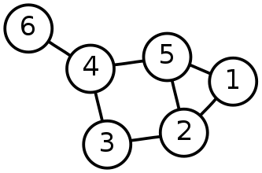
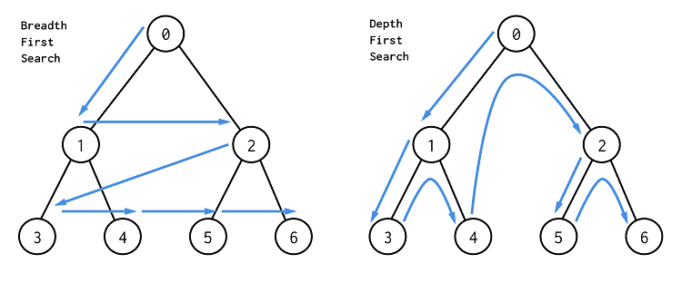
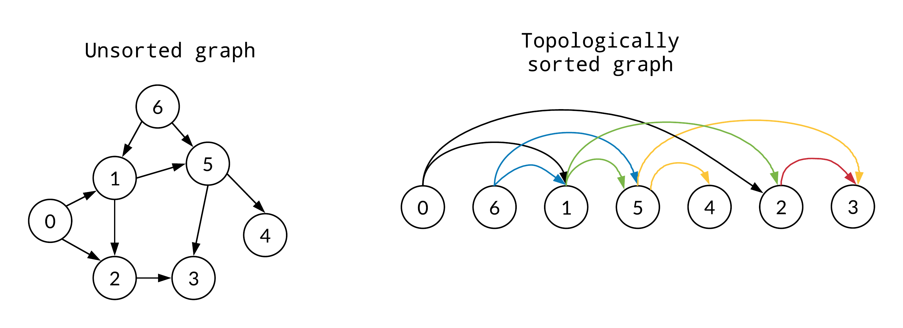
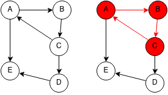
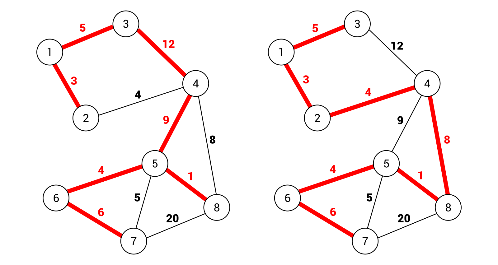
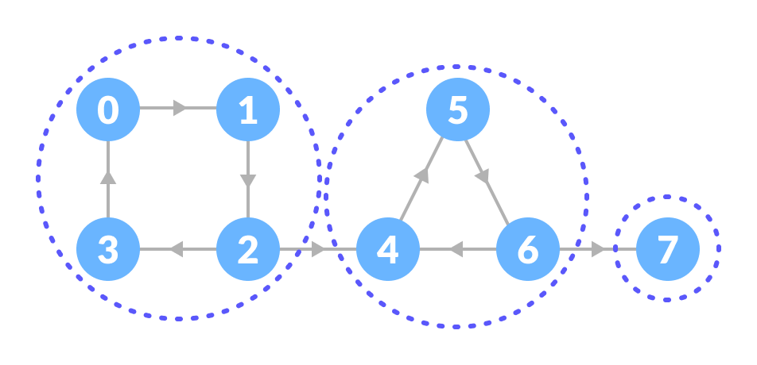

# Graph Theory

## Index

1. [Graph Traversal](https://github.com/VLVentura/DataStructures/tree/master/GraphTheory#graph-traversal)
	1. BFS
	2. DFS
2. [Topological Ordering](https://github.com/VLVentura/DataStructures/tree/master/GraphTheory#topological-ordering)
3. [Cycle Detection](https://github.com/VLVentura/DataStructures/tree/master/GraphTheory#cycle-detection)
4. [Shortest Path](https://github.com/VLVentura/DataStructures/tree/master/GraphTheory#shortest-path)
	1. Dijkstra Algorithm
	2. Bellman-Ford Algorithm
	3. DAG Algorithm
5. [Spanning Tree](https://github.com/VLVentura/DataStructures/tree/master/GraphTheory#spanning-tree)
	1. Kruskal Algorithm
	2. Prim's Algorithm - Lazy Implementation
	3. Prim's Algorithm - Eager Implementation
6. [Strongly Connected Components](https://github.com/VLVentura/DataStructures/tree/master/GraphTheory#strongly-connected-components)
	1. Kosaraju Algorithm
	2. Tarjan Algorithm

[*_Back to data structures_*](https://github.com/VLVentura/DataStructures#index)

### Graph Traversal

1. BFS
	* [x] [Java](https://github.com/VLVentura/DataStructures/tree/master/GraphTheory/GraphTraversal/BFS/java)
	* [ ] Python 
	* [ ] C++
	* [ ] C 

2. DFS
	* [x] [Java](https://github.com/VLVentura/DataStructures/tree/master/GraphTheory/GraphTraversal/DFS/java)
	* [ ] Python 
	* [ ] C++
	* [ ] C

[*_Back to index_*](https://github.com/VLVentura/DataStructures/tree/master/GraphTheory#index)

### Topological Ordering

* [x] [Java](https://github.com/VLVentura/DataStructures/tree/master/GraphTheory/TopologicalOrdering/java)
* [ ] Python 
* [ ] C++
* [ ] C

[*_Back to index_*](https://github.com/VLVentura/DataStructures/tree/master/GraphTheory#index)

### Cycle Detection

* [x] [Java](https://github.com/VLVentura/DataStructures/tree/master/GraphTheory/CycleDetection/java)
* [ ] Python 
* [ ] C++
* [ ] C

[*_Back to index_*](https://github.com/VLVentura/DataStructures/tree/master/GraphTheory#index)

### Shortest Path

1. Dijkstra Algorithm
	* [x] [Java](https://github.com/VLVentura/DataStructures/tree/master/GraphTheory/ShortestPath/DijkstraAlgorithm/java)
	* [ ] Python 
	* [ ] C++
	* [ ] C

2. Bellman-Ford Algorithm
	* [x] [Java](https://github.com/VLVentura/DataStructures/tree/master/GraphTheory/ShortestPath/BellmanFordAlgorithm/java)
	* [ ] Python 
	* [ ] C++
	* [ ] C

3. DAG(Directed Acyclic Graph) Algorithm
	* [x] [Java](https://github.com/VLVentura/DataStructures/tree/master/GraphTheory/ShortestPath/DAGAlgorithm/java)
	* [ ] Python 
	* [ ] C++
	* [ ] C

[*_Back to index_*](https://github.com/VLVentura/DataStructures/tree/master/GraphTheory#index)

### Spanning Tree

1. Kruskal Algorithm
	* [x] [Java](https://github.com/VLVentura/DataStructures/tree/master/GraphTheory/SpanningTrees/KruskalAlgorithm/java)
	* [ ] Python 
	* [ ] C++
	* [ ] C

2. Prim's Algorithm - Lazy Implementation
	* [x] [Java](https://github.com/VLVentura/DataStructures/tree/master/GraphTheory/SpanningTrees/PrimsAlgorithmLazy/java)
	* [ ] Python 
	* [ ] C++
	* [ ] C

3. Prim's Algorithm - Eager Implementation
	* [x] [Java](https://github.com/VLVentura/DataStructures/tree/master/GraphTheory/SpanningTrees/PrimsAlgorithmEager/java)
	* [ ] Python 
	* [ ] C++
	* [ ] C

[*_Back to index_*](https://github.com/VLVentura/DataStructures/tree/master/GraphTheory#index)

### Strongly Connected Components

1. Kosaraju Algorithm
	* [x] [Java](https://github.com/VLVentura/DataStructures/tree/master/GraphTheory/StronglyConnectedComponents/KosarajuAlgorithm/java)
	* [ ] Python 
	* [ ] C++
	* [ ] C

[*_Back to index_*](https://github.com/VLVentura/DataStructures/tree/master/GraphTheory#index)