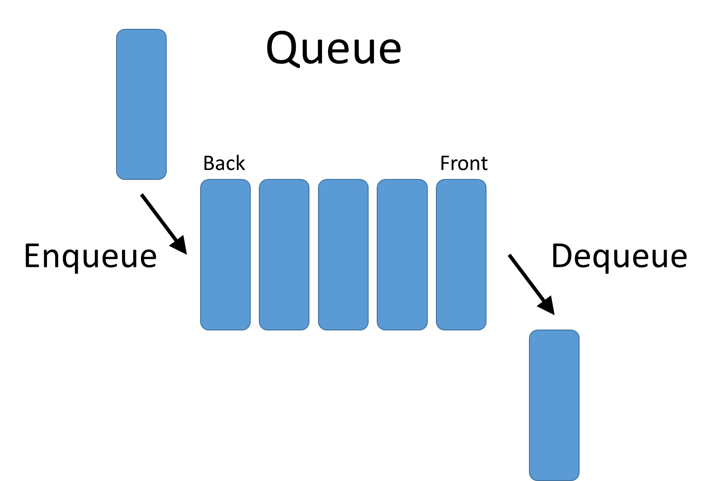
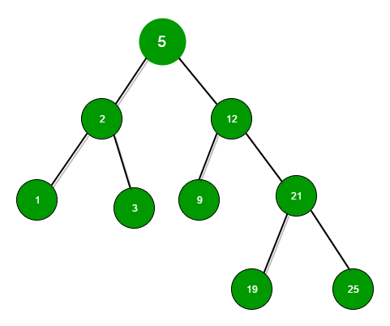
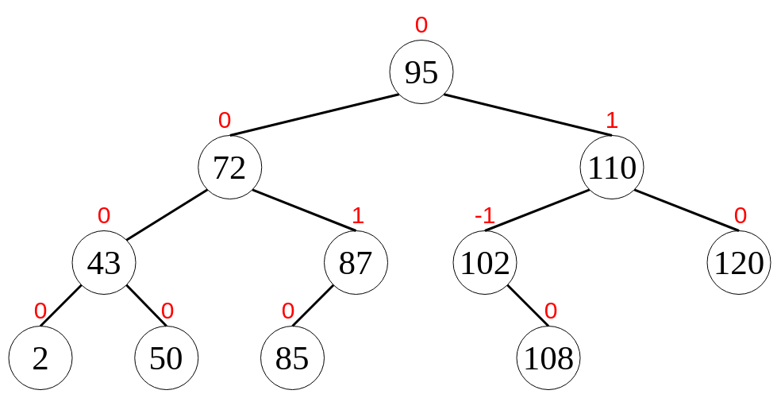
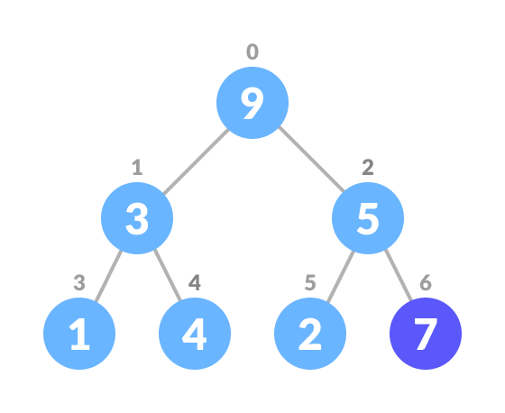
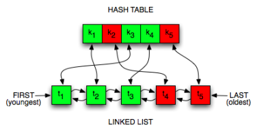
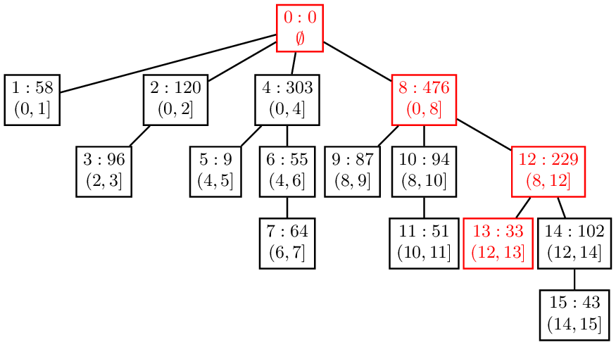
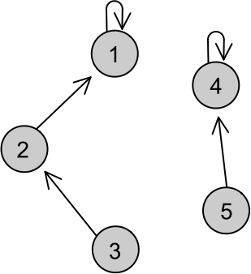

# Data Structures

1. [Index](https://github.com/VLVentura/DataStructures#index)
2. [How to Run [Linux]](https://github.com/VLVentura/DataStructures#how-to-run-linux)

## To-Do

* [ ] Fix the java code with some algorithms, they have some bugs
* [ ] Implement the graph algorithms in the run.py

## Index

1. [Linked Lists](https://github.com/VLVentura/DataStructures#linked-list)
2. [Stack](https://github.com/VLVentura/DataStructures#stack)
3. [Queue](https://github.com/VLVentura/DataStructures#queue)
4. [Binary Search Tree](https://github.com/VLVentura/DataStructures#binary-search-tree)
5. [AVL Tree](https://github.com/VLVentura/DataStructures#avl-tree)
6. [Red Black Tree](https://github.com/VLVentura/DataStructures#red-black-tree)
7. [Splay Trees](https://github.com/VLVentura/DataStructures#splay-tree)
8. [Pority Queue](https://github.com/VLVentura/DataStructures#priority-queue)
9. [Hash Tables](https://github.com/VLVentura/DataStructures#hash-table)
10. [LRU Cache](https://github.com/VLVentura/DataStructures#lru-cache)
11. [Fenwick Tree](https://github.com/VLVentura/DataStructures#fenwick-tree)
12. [Union-find/Disjoint-set](https://github.com/VLVentura/DataStructures#union-finddisjoint-set)
13. [Graph Theory](https://github.com/VLVentura/DataStructures/tree/master/GraphTheory#graph-theory)
14. Segment Tree

### Linked List


* [x] [Java](https://github.com/VLVentura/DataStructures/tree/master/LinkedList/java)
* [x] [Python](https://github.com/VLVentura/DataStructures/tree/master/LinkedList/python)
* [x] [C++](https://github.com/VLVentura/DataStructures/tree/master/LinkedList/cpp)
* [x] [C](https://github.com/VLVentura/DataStructures/tree/master/LinkedList/c)


[*_Back to index_*](https://github.com/VLVentura/DataStructures#index)


### Stack


* [x] [Java](https://github.com/VLVentura/DataStructures/tree/master/Stack/java)
* [x] [Python](https://github.com/VLVentura/DataStructures/tree/master/Stack/python)
* [x] [C++](https://github.com/VLVentura/DataStructures/tree/master/Stack/cpp)
* [ ] C 


[*_Back to index_*](https://github.com/VLVentura/DataStructures#index)


### Queue



* [x] [Java](https://github.com/VLVentura/DataStructures/tree/master/Queue/java)
* [x] [Python](https://github.com/VLVentura/DataStructures/tree/master/Queue/python)
* [x] [C++](https://github.com/VLVentura/DataStructures/tree/master/Queue/cpp)
* [ ] C 


[*_Back to index_*](https://github.com/VLVentura/DataStructures#index)


### Binary Search Tree



* [x] [Java](https://github.com/VLVentura/DataStructures/tree/master/BinarySearchTrees/java)
* [ ] Python 
* [x] [C++](https://github.com/VLVentura/DataStructures/tree/master/BinarySearchTrees/cpp)
* [ ] C 


[*_Back to index_*](https://github.com/VLVentura/DataStructures#index)


### AVL Tree



* [x] [Java](https://github.com/VLVentura/DataStructures/tree/master/AVLTrees/java)
* [ ] Python 
* [ ] C++
* [ ] C 


[*_Back to index_*](https://github.com/VLVentura/DataStructures#index)


### Red Black Tree


* [x] [Java](https://github.com/VLVentura/DataStructures/tree/master/RedBlackTrees/java)
* [ ] Python 
* [ ] C++
* [ ] C 


[*_Back to index_*](https://github.com/VLVentura/DataStructures#index)

### Splay Tree


* [x] [Java](https://github.com/VLVentura/DataStructures/tree/master/SplayTrees/java)
* [ ] Python 
* [ ] C++
* [ ] C 


[*_Back to index_*](https://github.com/VLVentura/DataStructures#index)


### Priority Queue



* [x] [Java](https://github.com/VLVentura/DataStructures/tree/master/PriorityQueue/java)
* [ ] Python 
* [ ] C++
* [ ] C 


[*_Back to index_*](https://github.com/VLVentura/DataStructures#index)


### Hash Table


* [x] [Java](https://github.com/VLVentura/DataStructures/tree/master/HashTable/java)
* [ ] Python 
* [ ] C++
* [ ] C 


[*_Back to index_*](https://github.com/VLVentura/DataStructures#index)


### LRU Cache



* [x] [Java](https://github.com/VLVentura/DataStructures/tree/master/LRUCache/java)
* [ ] Python 
* [ ] C++
* [ ] C 


[*_Back to index_*](https://github.com/VLVentura/DataStructures#index)


### Fenwick Tree



* [x] [Java](https://github.com/VLVentura/DataStructures/tree/master/FenwickTrees/java)
* [ ] Python 
* [ ] C++
* [ ] C 


[*_Back to index_*](https://github.com/VLVentura/DataStructures#index)


### Union-find/Disjoint-set



* [x] [Java](https://github.com/VLVentura/DataStructures/tree/master/UnionFindDisjointSet/java)
* [ ] Python 
* [ ] C++
* [ ] C 


[*_Back to index_*](https://github.com/VLVentura/DataStructures#index)

## How to Run [Linux]

Of course you can do it by yourself, open your terminal and write all the commands as normal. But, i made a simple script that can help you in just focus on the data structure and algorithm part! 

1. Make sure the **run.py** had permissions to execute. To do that you can open the terminal at the DataStructures/ folder and run the command

```
chmod 755 run.py
```

You can understand what this command mean by acessing [this link](https://www.howtogeek.com/437958/how-to-use-the-chmod-command-on-linux/)

2. Now you can execute the command passing the data structure you want to execute and the language you want to teste

```
./run.py -<data structure> -<language>
```

Examples:

```
./run.py -list -c++
```

```
./run.py -queue -python
```

You can check the table below to see all the commands

<table>
<tr><th>Data Structures </th><th>Languages</th></tr>
<tr><td>

Data Structures | Command  
----------- | ------------- 
Linked List | -list
Stack | -stack
Queue | -queue
Binary Search Tree | -bst
AVL Tree | -avl
Red Black Tree | -rbt
Splay Tree | -splay
Priority Queue | -pqueue
Hash Table | -hasht
LRU Cache | -lru
Fenwick Tree | -fenwick
Union-Find Disjoint-Set | -disjointset

</td><td>

Languages | Command  
----------- | ------------- 
Python | -python
Java | -java
C++ | -c++
C | -c

</td></tr> </table>

