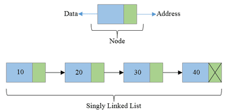

# Data Structures

**To-do**
* [ ] How to run will be in a simple readme in each data structure for the specific language
* [ ] Fixed some issues with the java code to make a good tutorial on compile and execution process

## Index

1. [Linked Lists](https://github.com/VLVentura/DataStructures#linked-list)
2. [Stack](https://github.com/VLVentura/DataStructures#stack)
3. [Queue](https://github.com/VLVentura/DataStructures#queue)
4. [Binary Search Tree](https://github.com/VLVentura/DataStructures#binary-search-tree)
5. [AVL Tree](https://github.com/VLVentura/DataStructures#avl-tree)
6. [Red Black Tree](https://github.com/VLVentura/DataStructures#red-black-tree)
7. [Splay Trees](https://github.com/VLVentura/DataStructures#splay-tree)
8. [Pority Queue](https://github.com/VLVentura/DataStructures#priority-queue)
9. [Hash Tables](https://github.com/VLVentura/DataStructures#hash-table)
10. [LRU Cache](https://github.com/VLVentura/DataStructures#lru-cache)
11. [Fenwick Tree](https://github.com/VLVentura/DataStructures#fenwick-tree)
12. [Union-find/Disjoint-set](https://github.com/VLVentura/DataStructures#union-finddisjoint-set)
13. [Graph Theory](https://github.com/VLVentura/DataStructures/tree/master/GraphTheory#graph-theory)
14. Segment Tree

### Linked List

* [x] [Java](https://github.com/VLVentura/DataStructures/tree/master/LinkedList/java)
* [x] [Python](https://github.com/VLVentura/DataStructures/tree/master/LinkedList/python)
* [x] [C++](https://github.com/VLVentura/DataStructures/tree/master/LinkedList/cpp)
* [x] [C](https://github.com/VLVentura/DataStructures/tree/master/LinkedList/c)

[*_Back to index_*](https://github.com/VLVentura/DataStructures#index)

### Stack

* [x] [Java](https://github.com/VLVentura/DataStructures/tree/master/Stack/java)
* [x] [Python](https://github.com/VLVentura/DataStructures/tree/master/Stack/python)
* [x] [C++](https://github.com/VLVentura/DataStructures/tree/master/Stack/cpp)
* [ ] C 

[*_Back to index_*](https://github.com/VLVentura/DataStructures#index)

### Queue

* [x] [Java](https://github.com/VLVentura/DataStructures/tree/master/Queue/java)
* [x] [Python](https://github.com/VLVentura/DataStructures/tree/master/Queue/python)
* [x] [C++](https://github.com/VLVentura/DataStructures/tree/master/Queue/cpp)
* [ ] C 

[*_Back to index_*](https://github.com/VLVentura/DataStructures#index)

### Binary Search Tree

* [x] [Java](https://github.com/VLVentura/DataStructures/tree/master/BinarySearchTrees/java)
* [ ] Python 
* [x] [C++](https://github.com/VLVentura/DataStructures/tree/master/BinarySearchTrees/cpp)
* [ ] C 

[*_Back to index_*](https://github.com/VLVentura/DataStructures#index)

### AVL Tree

* [x] [Java](https://github.com/VLVentura/DataStructures/tree/master/AVLTrees/java)
* [ ] Python 
* [ ] C++
* [ ] C 

[*_Back to index_*](https://github.com/VLVentura/DataStructures#index)

### Red Black Tree

* [x] [Java](https://github.com/VLVentura/DataStructures/tree/master/RedBlackTrees/java)
* [ ] Python 
* [ ] C++
* [ ] C 

[*_Back to index_*](https://github.com/VLVentura/DataStructures#index)

### Splay Tree

* [x] [Java](https://github.com/VLVentura/DataStructures/tree/master/SplayTrees/java)
* [ ] Python 
* [ ] C++
* [ ] C 

[*_Back to index_*](https://github.com/VLVentura/DataStructures#index)

### Priority Queue

* [x] [Java](https://github.com/VLVentura/DataStructures/tree/master/PriorityQueue/java)
* [ ] Python 
* [ ] C++
* [ ] C 

[*_Back to index_*](https://github.com/VLVentura/DataStructures#index)

### Hash Table

* [x] [Java](https://github.com/VLVentura/DataStructures/tree/master/HashTable/java)
* [ ] Python 
* [ ] C++
* [ ] C 

[*_Back to index_*](https://github.com/VLVentura/DataStructures#index)

### LRU Cache

* [x] [Java](https://github.com/VLVentura/DataStructures/tree/master/LRUCache/java)
* [ ] Python 
* [ ] C++
* [ ] C 

[*_Back to index_*](https://github.com/VLVentura/DataStructures#index)

### Fenwick Tree

* [x] [Java](https://github.com/VLVentura/DataStructures/tree/master/FenwickTrees/java)
* [ ] Python 
* [ ] C++
* [ ] C 

[*_Back to index_*](https://github.com/VLVentura/DataStructures#index)

### Union-find/Disjoint-set

* [x] [Java](https://github.com/VLVentura/DataStructures/tree/master/UnionFindDisjointSet/java)
* [ ] Python 
* [ ] C++
* [ ] C 

[*_Back to index_*](https://github.com/VLVentura/DataStructures#index)